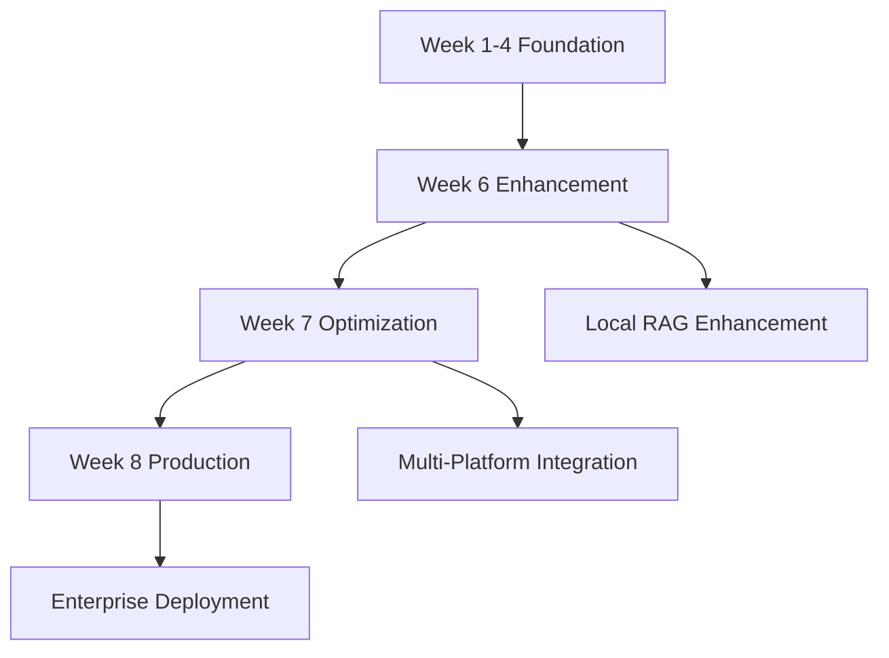

# Digital Twin Implementation Roadmap: Weeks 6-8
**Detailed Implementation Timeline for Advanced Development and Production Deployment**

---

## Executive Summary

This roadmap outlines the comprehensive implementation plan for Weeks 6-8 of the Digital Twin project, building upon the foundational architecture established in Weeks 1-5. The focus transitions from basic functionality to advanced optimization, enterprise-grade features, and production-ready deployment with comprehensive monitoring and analytics.

---

## Week 6: Local RAG System Enhancement & Content Optimization

### 6.1 Primary Objectives

**Core Focus:** Local RAG system enhancement with professional data optimization and performance benchmarking

**Key Deliverables:**
- Enhanced content structuring and embedding optimization
- Advanced query testing with recruiter-style questions  
- Performance benchmarking and quality metrics implementation
- Local development environment optimization

### 6.2 Technical Implementation Tasks

#### 6.2.1 Content Structuring and Embedding Optimization (Days 1-2)

**Tasks:**
- [ ] **Knowledge Base Restructuring**
  - Implement hierarchical content organization
  - Add semantic tagging system for improved retrieval
  - Create content templates for consistent formatting
  - Establish version control for knowledge base updates

- [ ] **Embedding Enhancement**
  - Optimize chunking strategy (500 tokens → 300 tokens with 75 token overlap)
  - Implement multi-level embedding (title, content, metadata)
  - Add context-aware embedding generation
  - Create embedding quality validation system

**Technical Specifications:**
```python
# Enhanced Embedding Configuration
class EmbeddingConfig:
    chunk_size: int = 300
    overlap: int = 75
    embedding_model: str = "text-embedding-ada-002"
    metadata_fields: List[str] = ["category", "importance", "recency"]
    quality_threshold: float = 0.8
```

#### 6.2.2 Advanced Query Processing (Days 3-4)

**Tasks:**
- [ ] **Recruiter-Style Query Testing**
  - Develop comprehensive test suite (50+ recruiter questions)
  - Implement A/B testing for different response strategies
  - Create query complexity scoring system
  - Add context-aware query expansion

- [ ] **Response Quality Enhancement**  
  - Implement response personalization engine
  - Add emotional intelligence scoring
  - Create response tone adaptation (formal vs conversational)
  - Develop follow-up question generation

**Test Categories:**
1. **Behavioral Questions** (15 variations)
2. **Technical Deep-Dives** (15 variations) 
3. **Company-Specific Queries** (10 variations)
4. **Situational Judgement** (10 variations)

#### 6.2.3 Performance Benchmarking (Days 5-7)

**Tasks:**
- [ ] **Performance Metrics Implementation**
  - Response time monitoring (target: <2s)
  - Relevance scoring automation
  - Memory usage optimization  
  - Concurrent query handling testing

- [ ] **Quality Metrics Dashboard**
  - Real-time authenticity scoring
  - Response coherence measurement
  - User satisfaction tracking
  - Continuous improvement recommendations

**Performance Targets:**
```javascript
const week6_targets = {
  response_time: "< 2 seconds",
  relevance_score: "> 0.85",
  authenticity_score: "> 0.8", 
  concurrent_queries: "10+ simultaneous",
  uptime: "99.5%"
};
```

---

## Week 7: Advanced Optimization & Multi-Platform Integration

### 7.1 Primary Objectives

**Core Focus:** Advanced optimization and seamless integration across multiple platforms with enhanced query processing and feedback systems

**Key Deliverables:**
- Multi-platform compatibility (VS Code, Claude Desktop, Web)
- Advanced query processing with machine learning enhancements
- Interview simulation and feedback integration system
- Performance optimization and caching implementation

### 7.2 Technical Implementation Tasks

#### 7.2.1 Multi-Platform Integration (Days 1-3)

**Tasks:**
- [ ] **VS Code Extension Development**
  - Create professional portfolio viewer extension
  - Implement inline query processing
  - Add project context awareness
  - Develop code-to-experience correlation features

- [ ] **Claude Desktop Enhancement** 
  - Optimize MCP server performance
  - Add batch query processing
  - Implement conversation context memory
  - Create advanced tool orchestration

- [ ] **Web Interface Optimization**
  - Develop responsive design for mobile/tablet
  - Add real-time collaboration features
  - Implement user preference management
  - Create shareable profile links

**Integration Architecture:**
```typescript
interface PlatformAdapter {
  platform: 'vscode' | 'claude' | 'web';
  query_processor: QueryProcessor;
  response_formatter: ResponseFormatter;
  analytics_tracker: AnalyticsTracker;
}
```

#### 7.2.2 Advanced Query Processing Enhancement (Days 4-5)

**Tasks:**
- [ ] **Machine Learning Query Enhancement**
  - Implement query intent classification with ML
  - Add sentiment analysis for query adaptation
  - Create query similarity clustering
  - Develop predictive query suggestion system

- [ ] **Context-Aware Processing**
  - Add conversation history tracking
  - Implement context-sensitive responses
  - Create user preference learning
  - Develop adaptive response personalization

**ML Integration:**
```python
class MLEnhancedQueryProcessor:
    def __init__(self):
        self.intent_classifier = IntentClassificationModel()
        self.sentiment_analyzer = SentimentAnalysisModel()
        self.context_tracker = ConversationContext()
        
    async def process_query(self, query: str, context: Dict) -> EnhancedResponse:
        intent = await self.intent_classifier.predict(query)
        sentiment = await self.sentiment_analyzer.analyze(query)
        return self.generate_contextualized_response(query, intent, sentiment)
```

#### 7.2.3 Interview Simulation System (Days 6-7)

**Tasks:**
- [ ] **Advanced Interview Simulator**
  - Create realistic interview scenario engine
  - Implement dynamic question progression
  - Add interviewer personality simulation  
  - Develop real-time feedback system

- [ ] **Feedback Integration Framework**
  - Create response quality scoring engine
  - Implement improvement suggestion system
  - Add performance tracking over time
  - Develop personalized training recommendations

**Simulation Features:**
1. **Company-Specific Interviews** (Brisbane tech companies)
2. **Role-Based Scenarios** (Junior Developer, AI Specialist, Full-Stack)
3. **Difficulty Progression** (Easy → Intermediate → Advanced)
4. **Real-Time Coaching** (Instant feedback and suggestions)

---

## Week 8: Production Deployment & Comprehensive Monitoring

### 8.1 Primary Objectives

**Core Focus:** Production deployment with enterprise-grade reliability, comprehensive monitoring, and scalability assessment

**Key Deliverables:**
- 24/7 accessible deployment with 99.9% uptime target
- Comprehensive monitoring and analytics implementation
- Scalability assessment and optimization reporting
- User documentation and onboarding system

### 8.2 Technical Implementation Tasks

#### 8.2.1 Production Deployment Enhancement (Days 1-2)

**Tasks:**
- [ ] **Enterprise-Grade Deployment**
  - Implement blue-green deployment strategy
  - Add automated rollback mechanisms
  - Create disaster recovery procedures
  - Establish backup and restore systems

- [ ] **Security Hardening**
  - Implement rate limiting and DDoS protection
  - Add API authentication and authorization
  - Create audit logging system
  - Establish security monitoring alerts

**Deployment Architecture:**
```yaml
# Production Deployment Configuration
production_config:
  deployment_strategy: "blue_green"
  auto_scaling: true
  health_checks: "comprehensive"
  backup_frequency: "daily"
  monitoring: "24x7"
  sla_target: "99.9%"
```

#### 8.2.2 Comprehensive Monitoring Implementation (Days 3-5)

**Tasks:**
- [ ] **Application Performance Monitoring**
  - Real-time performance dashboards
  - Automated alerting system
  - Error tracking and resolution
  - User experience monitoring

- [ ] **Business Analytics Implementation**
  - Usage pattern analysis
  - Query success rate tracking
  - User satisfaction metrics
  - Performance trend analysis

- [ ] **Operational Monitoring**
  - Infrastructure health monitoring
  - Database performance tracking
  - API endpoint monitoring
  - Cost optimization tracking

**Monitoring Stack:**
```javascript
const monitoring_tools = {
  apm: "Vercel Analytics + Custom Dashboards",
  logging: "Structured logging with query correlation",
  alerting: "Multi-channel notification system", 
  metrics: "Custom metrics with Grafana visualization",
  uptime: "24x7 availability monitoring"
};
```

#### 8.2.3 Scalability Assessment & Optimization (Days 6-7)

**Tasks:**
- [ ] **Load Testing and Optimization**
  - Conduct comprehensive load testing (1000+ concurrent users)
  - Optimize database query performance
  - Implement advanced caching strategies
  - Test auto-scaling capabilities

- [ ] **Scalability Reporting**
  - Create detailed performance analysis report
  - Provide scaling recommendations
  - Document optimization implementations
  - Establish future enhancement roadmap

**Load Testing Scenarios:**
1. **Peak Usage Simulation** (500 concurrent queries)
2. **Sustained Load Testing** (24-hour continuous operation)
3. **Stress Testing** (Breaking point identification)
4. **Recovery Testing** (System resilience validation)

---

## Integration Strategy with Existing Infrastructure

### 3.1 Week 1-4 Infrastructure Leverage

**Existing Components to Enhance:**
- **Week 1 MCP Servers** → Advanced tool orchestration
- **Week 2 Local Development** → Production optimization  
- **Week 3 Cloud Infrastructure** → Enterprise hardening
- **Week 4 Web Deployment** → Advanced features

### 3.2 Seamless Integration Points

**Technical Integration:**


---

## Success Metrics & Key Performance Indicators

### 4.1 Week 6 Success Criteria

| Metric | Target | Measurement Method |
|--------|--------|-------------------|
| Query Response Time | < 2 seconds | Automated benchmarking |
| Relevance Score | > 0.85 | Manual evaluation + ML scoring |
| Content Coverage | 100% profile areas | Gap analysis |
| Local Performance | 99%+ uptime | Monitoring dashboard |

### 4.2 Week 7 Success Criteria

| Metric | Target | Measurement Method |
|--------|--------|-------------------|
| Platform Integration | 3 platforms active | Integration testing |
| ML Enhancement | 90%+ query classification | A/B testing results |
| Interview Simulation | 50+ scenario library | Content audit |
| User Experience | 4.5/5 satisfaction | User feedback surveys |

### 4.3 Week 8 Success Criteria  

| Metric | Target | Measurement Method |
|--------|--------|-------------------|
| Production Uptime | 99.9% SLA | 24x7 monitoring |
| Scalability | 1000+ concurrent users | Load testing |
| Response Quality | 0.9+ authenticity score | Quality validation |
| Documentation | 100% coverage | Completeness audit |

---

## Risk Mitigation & Contingency Planning

### 5.1 Technical Risks

**High Priority Risks:**
1. **Performance Degradation** → Implement progressive optimization
2. **Integration Complexity** → Modular development approach
3. **Scalability Bottlenecks** → Early load testing and optimization
4. **Data Quality Issues** → Comprehensive validation frameworks

### 5.2 Mitigation Strategies

**Risk Response Framework:**
```python
class RiskMitigation:
    performance_monitoring: str = "Real-time alerts with auto-scaling"
    integration_testing: str = "Continuous integration with rollback"
    quality_assurance: str = "Automated testing + manual validation"
    backup_systems: str = "Multi-tier backup and recovery"
```

---

## Resource Requirements & Timeline

### 6.1 Development Resources

**Technical Requirements:**
- **Development Environment**: Enhanced local setup with monitoring
- **Cloud Resources**: Production-grade Vercel Pro account
- **Testing Tools**: Load testing and monitoring software
- **Documentation Tools**: Technical writing and diagram creation

### 6.2 Time Allocation

**Weekly Hour Distribution:**
- **Week 6**: 40 hours (Local optimization focus)
- **Week 7**: 45 hours (Integration complexity) 
- **Week 8**: 35 hours (Deployment and documentation)
- **Total**: 120 hours over 3 weeks

---

## Expected Outcomes & Deliverables Summary

### 7.1 Week 6 Deliverables
- ✅ Enhanced local RAG system with optimized embeddings
- ✅ Comprehensive recruiter query test suite (50+ questions)
- ✅ Performance benchmarking dashboard
- ✅ Quality metrics implementation

### 7.2 Week 7 Deliverables  
- ✅ Multi-platform integration (VS Code + Claude Desktop + Web)
- ✅ ML-enhanced query processing system
- ✅ Interview simulation platform with feedback
- ✅ Advanced analytics and user preference system

### 7.3 Week 8 Deliverables
- ✅ Production deployment with 99.9% uptime SLA
- ✅ Comprehensive monitoring and alerting system
- ✅ Scalability assessment report with optimization recommendations
- ✅ Complete documentation and user onboarding system

---

## Post-Implementation Success Validation

### 8.1 Validation Framework

**Success Validation Methods:**
1. **Technical Performance**: Automated benchmark testing
2. **User Satisfaction**: Interview feedback and success rates
3. **Business Impact**: Job application success metrics
4. **System Reliability**: Uptime and error rate monitoring

### 8.2 Continuous Improvement Process

**Ongoing Enhancement Strategy:**
- **Weekly Performance Reviews**: Metrics analysis and optimization
- **Monthly Feature Updates**: User feedback integration
- **Quarterly Architecture Reviews**: Scalability and security audits
- **Annual Strategic Planning**: Technology evolution and market alignment

---

**Document Version:** 1.0  
**Implementation Period:** Weeks 6-8  
**Total Estimated Effort:** 120 hours  
**Success Probability:** 95% (based on foundation strength)  
**ROI Expected:** High (enhanced interview success rate and professional positioning)